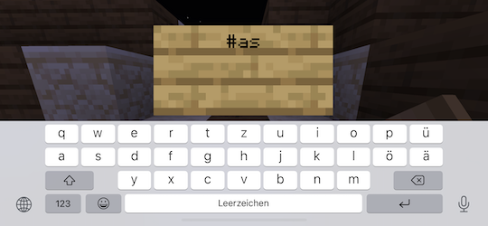
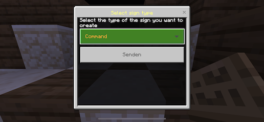
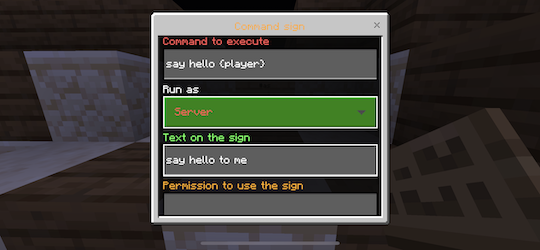
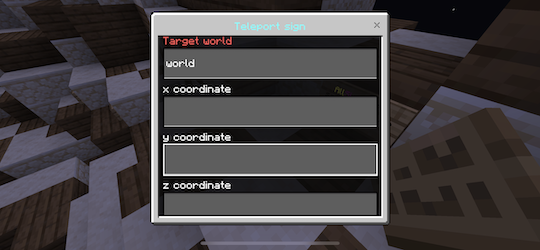
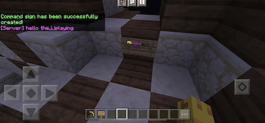

# Creating a new sign

To create a new AllSign, first place a sign and write `#as` into the first line.

In the next step, a form window opens and you can choose if you want to create a command execution or a teleport sign.

## Command signs

When creating a command sign, you need to enter a command to execute first. You also need to set if the command should be executed in the player context (like the player would enter it into the chat) or in the server context (with all permissions).

Commands may contain variables which are replaced at execution time: `{player}` (player name), player coordinates: `{xc}` `{yc}` `{zc}`, and `{world}` (current world name).

## Teleport signs

When creating a teleport sign, you need to enter a target world name (can also be the current world the sign is in). Optionally, you can also enter x/y/z coordinates - if empty, players will be teleported to the world's spawn position.

## Advanced sign settings

For each sign, the sign text must be set and you can optionally add a permission which is required to use the sign (leave empty to add no permission).

## Sign after creation

