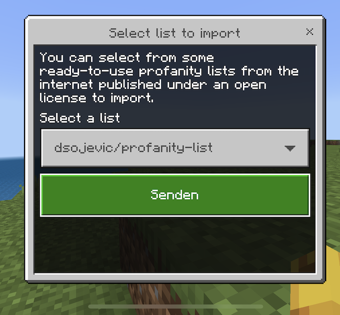
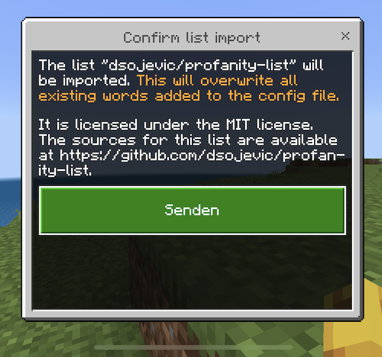

# Importing swear word lists

You can import ready-to-use profanity word list from internet sources published under an open license.

:::caution

When importing a new list, all blocked words added to the config file before will be **overwritten**.

:::

Use the command `/badwordblocker import` to start the import process.

Then, choose a list you want to import:

As a second step, you need to confirm the action and the license of the list to import:

After confirming, the list will be imported and saved to the config.
You will receive a message in the chat when the import process was successful and the new list is active.
