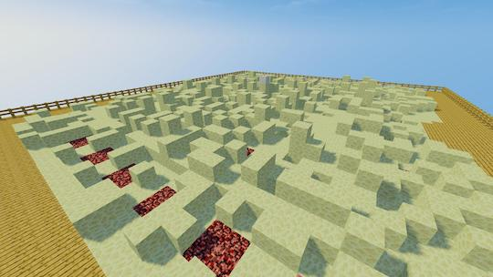

# Creating a game world

The HotBlock plugin is developed to use one dedicated world on the server as the "game world". You can build this world yourself or download a pre-built one from [here](https://static.surva.net/osplugins/HotBlock.zip).

The game world should contain the following blocks:

| Block        | PvP | Effect                                                                            |
| ------------ | --- | --------------------------------------------------------------------------------- |
| `WOOD`       | ❌  | All players are safe, usually they spawn there                                    |
| `ENDSTONE`   | ✅  | Normal playing field, nothing special here                                        |
| `NETHERRACK` | ✅  | Players get poisoned for 2-3 seconds when walking over those blocks               |
| `QUARTBLOCK` | ✅  | The HotBlock, players are earning some coins per second when moving on this block |

Thats an example how this world could look like:

