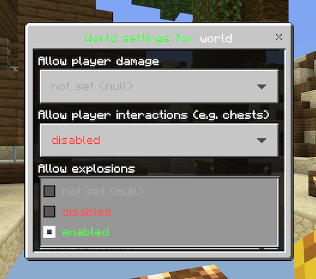

# Set control flags

## Using the Forms GUI

An easy way for beginners to set control flags in worlds is using the Forms GUI.

You can open the GUI using the command `/worlds set` (for current world flags) or `/worlds defaults` (for default world flags).

The corresponding permissions are `worlds.admin.set` and `worlds.admin.defaults`, short commands are `/ws st` and `/ws df`.

## Using commands

All commands require the permission `worlds.admin.set`, the short version of the commands is `/ws st [...]`.

### /worlds set show

List all flags and their values in a world

Examples: `/worlds set show`

### /worlds set permission &#60;permissionstring&#62;

Set a permission which is needed to join the world (cannot be set on default world)

Examples:

`/worlds set permission you.arecool` - Only players with the permission `you.arecool` are allowed to join the world

### /worlds set gamemode &#60;gamemodename&#62;

Set the world's game mode (possible values are `survival`, `creative`, `adventure` or `spectator`)

Examples:

`/worlds set gamemode creative` - Set the game mode of this world to `creative`

### Control list flags

The following flags support control lists: see [here](./../flags).

They can be set to four possible operation modes:

| Operation mode | Description           |
| -------------- | --------------------- |
| `true`         | Generally allow       |
| `false`        | Always deny           |
| `white`        | Only allow white list |
| `black`        | Not allow black list  |

Examples:

- `build` set to `false` doesn't allow building
- `command` set to `black` doens't allow executing commands which are on the black list
- `drop` set to `white` only allows dropping items which are on the white list

**Command: /worlds set &#60;flag&#62; &#60;value&#62;**

Examples:

`/worlds set build white` - Allow building only blocks which are added to the control list (whitelist mode) in this world  
`/worlds set command black` - Allow executing commands except those which are added to the control list (blacklist mode) in this world  
`/worlds set interact false` - Disable interaction (opening chests, ...) in this world

### Normal flags

The following flags are normal flags without support for control lists: see [here](./../flags).

They can be set to `true` (allow) or `false` (deny).

**Command: /worlds set &#60;flag&#62; &#60;value&#62;**

Examples:

`/worlds set explode false` - Disable explosions in this world  
`/worlds set hunger true` - Enable hunger in this world  
`/worlds set daylightcycle false` - Disable day and night cycling in this world
